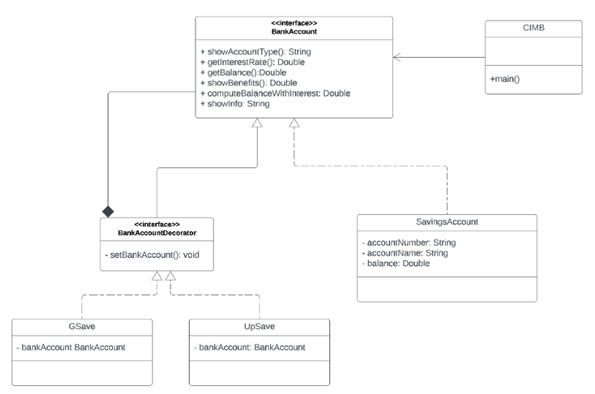

# Decorator Pattern

## Problem Statement

CIMB is a digital bank that offers GSave and UpSave savings accounts.   As with a typical Savings Account, it contains accountNumber, accountName, and a balance for that account.

The typical savings account offers an interest rate of 1%.
The benefits of the typical savings account is the same with the "Standard Savings Account" as compared to other banks.

The GSave account offers an interest rate of 2.5%.
Benefits include the "Standard Savings Account" plus access to "GCash transfer".

The UpSave account offers the highest interest rate of 4.0%.
Benefits include the "Standard Savings Account" plus "with Insurance".

**Description of the following methods:**
1. **showAccountType()** - Either returns "Savings Account", "GSave" or "UpSave"
2. **getInterestRate()** - Either returns 1% for Savings Account; 2.5% for GSave; 4.0% UpSave
3. **getBalance()** - Returns the balance of the account set.
4. **computeBalanceWithInterest()** - returns new balance by computing the balance plus the interest depending on the interest rate.
5. **showInfo()** - Returns details of account number, account name, and balance.
6. **HotelApp:** The client class that uses the FrontDesk facade to access and utilize hotel services seamlessly.

**BankAcountDecorator** must be an interface.

Follow instructions.  You are not allowed to insert other methods except what is stated in the diagram (setters and getters are allowed).

## UML Class Diagram
